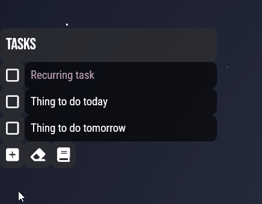
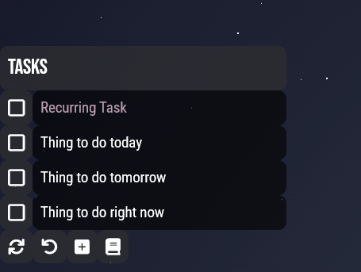
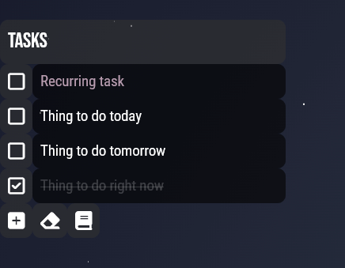

# uhe ToDo List

**This branch needs https://github.com/Joehuu/uhe in the same `Rainmeter/Skins` folder to work correctly.**

Simple Rainmeter todo list skin based on https://github.com/Pernickety/rainmeter-todo-list.

## Installing

* Download and place entire `uhe-todo-list` folder in your Rainmeter skins location
* Activate `uhe-todo-list` skin
    * Do this by right-clicking on an already active skin to bring up the Rainmeter menu
    * Navigate to `Rainmeter > Skins > uhe-todo-list > todo > todo.ini`
        * If you do not see `uhe-todo-list` in the skin selection, try navigating to `Rainmeter > Refresh all`

## Usage

* Refresh button can be used to update the task list if you edit the `tasks.txt` file directly
* Reset button can be used to reset the status of all tasks and remove completed, non-recurring tasks
* Add button will allow you to add more tasks without editing the `tasks.txt` file directly

## Editing Tasks Directly

A quick way to get to the correct file path is to right-click the todo list and select `Manage skin` from Rainmeter's menu. Now right-click the `todo` folder and select `Open folder` - an explorer window should open you right to the txt location.

* Each line is a new task
* The file should have an empty line at the end to preserve proper formatting
* Lines that start with +... are completed
* Lines that end with ...|R are recurring

Once you are done editing the file you can save and close it. Now click the Refresh button (furthest left) below the task list. Your changes should now be visible.
